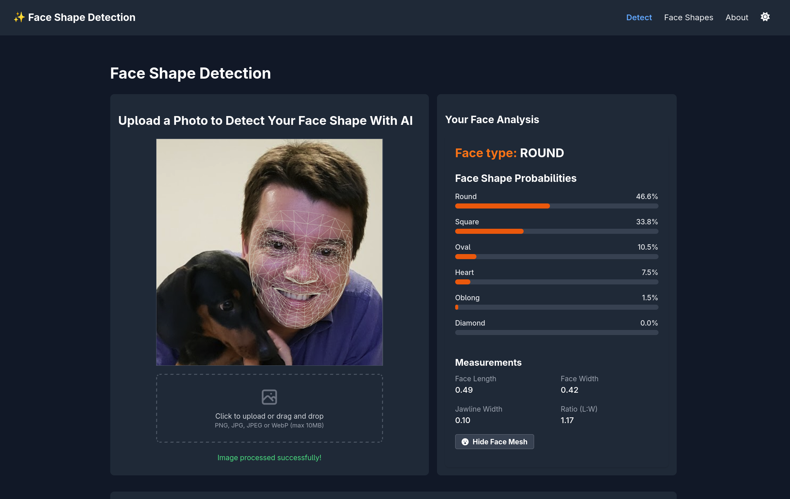

# Face Shape Detection



Face Shape Detection is a modern React web application that helps users discover their face shape through AI-powered analysis. By analyzing facial landmarks, the application determines whether your face is oval, round, square, heart, diamond, or oblong, and provides personalized recommendations based on your results.

## 🌟 Features

- **AI-powered face shape detection** using MediaPipe's face mesh technology
- **Real-time analysis** of facial measurements and proportions
- **Comprehensive guides** for each face shape with recommendations for:
  - Hairstyles
  - Eyewear
  - Makeup techniques
- **Light and dark mode support** with automatic theme detection
- **Multilingual support** (English and Brazilian Portuguese)
- **Privacy-focused** - all image processing happens in-browser, no photos are uploaded to servers

## 🚀 Live Demo

Check out the live application at: [https://myfaceshape.pro/](https://myfaceshape.pro/)

## 💻 Technology Stack

- **Frontend**: React 19.0
- **Styling**: TailwindCSS 3.4
- **Build Tool**: Vite 6.2
- **Image Processing**: MediaPipe Face Mesh
- **Analytics**: PostHog
- **Deployment**: Custom deployment script

## 🔍 How It Works

1. **Upload** a clear photo of your face
2. The application **analyzes** key facial measurements:
   - Face length (forehead to chin)
   - Face width (cheek to cheek)
   - Jawline width and angle
   - Forehead width
3. Using these measurements, the algorithm **calculates ratios** and determines your face shape
4. View your results with **confidence scores** for each face shape type
5. Explore **personalized recommendations** based on your face shape

## 🌙 Light/Dark Mode

The application automatically detects your system's theme preference and also allows manual theme switching. The dark mode provides a comfortable viewing experience in low-light environments.

## 🔒 Privacy

Your photos are processed entirely in your browser and are never uploaded to our servers. We respect your privacy and ensure your data remains secure.

## 🛠️ Development

### Prerequisites

- Node.js (version 16 or higher recommended)
- npm or yarn

### Installation

```bash
# Clone the repository
git clone https://github.com/henzogomes/face-shape-detection.git

# Navigate to project folder
cd face-shape-detection

# Install dependencies
npm install

# Run development server
npm run dev

# Build for production
npm run build
```

## 👤 Author

**Henzo Gomes**

- GitHub: [@henzogomes](https://github.com/henzogomes)

---

Made with ✨ using AI-powered facial recognition technology
